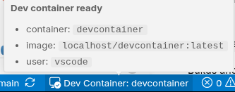
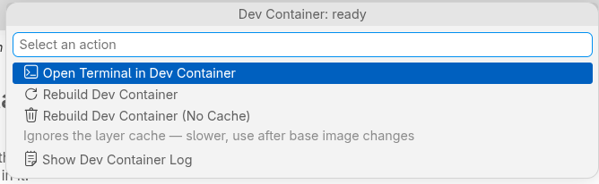

# DevContainer runtime support with podman

> ## ⚠️ Proof of concept — not for production use
>
> This is an experiment attached to [eclipse-che/che#23458](https://github.com/eclipse-che/che/issues/23458),
> exploring whether `devcontainer.json` can define an Eclipse Che workspace environment. It is
> **not supported, not hardened, and not recommended for anything you care about.**
>
> Known limitations at this stage:
>
> - Depends on `start-devcontainer.sh` being present in the workspace, and on devfile task labels
>   matching exactly — both are unstable interfaces that will change.
> - The dev container is given no cluster credentials, but it does run arbitrary code from the
>   repository with `--network=host` in the workspace pod's network namespace.
> - Extensions declared in `devcontainer.json` are surfaced as recommendations, not installed.
> - Editor settings from `devcontainer.json` are applied at machine scope, so user settings win
>   over them — the reverse of how workspace settings normally behave.
> - Error handling is thin: a failed build reports the task exit code, not a diagnosis.
>
> This is a personal experiment, not an Eclipse Che project deliverable, and not affiliated
> with or endorsed by the Eclipse Foundation. Discussion belongs on the tracking issue above.

Builds and runs the environment declared in `devcontainer.json` as a rootless podman container
inside an Eclipse Che workspace, and opens terminals in it.

## Design

The extension owns **no devcontainer logic**. `start-devcontainer.sh` in the workspace remains the
engine — it resolves the config, builds the image, runs lifecycle commands and starts the
container. This extension is the UI over it:

- reads resolved terminal configuration from the setup runtime description and verifies its
  container ID and running state with `podman inspect`; task events track builds in flight
- renders a status bar item (`building` / `ready` / `failed`)
- notifies on transition, with **Open Terminal** / **Show Log**
- provides **Open Terminal in Dev Container** and an explicitly selectable `devcontainer`
  profile; regular new terminals remain in the outer workspace container
- runs the existing devfile tasks for rebuild and log, rather than reimplementing them

Keeping the engine in the script keeps the che-code diff small and lets the script stay
independently testable.

## How state is determined

| Question | Source |
| --- | --- |
| Ready, and with which user and folder? | Setup runtime JSON plus container ID/running-state verification |
| Stale against `devcontainer.json`? | `che.devcontainer.config` fingerprint label |
| Build running, started here? | `onDidStartTask` / `onDidEndTask` |
| Build running, started elsewhere? | PID in the setup script's lock file |
| Build failed? | task exit code |

Setup publishes a private, atomic runtime description after success and removes it before the
next setup attempt. It supplies the engine, container ID/name, user, working directory, shell,
and resolved environment, so the extension does not reimplement config resolution. See
[the integration contract](docs/script-integration.md). The setup lock's owner PID lets the
extension detect builds started before the window opened.

## What it replaces

| Before | After |
| --- | --- |
| HTTP server + ready page + port cycling + public endpoint + Route | `showInformationMessage` |
| Terminal profile written to machine settings, then "reload the window" | `registerTerminalProfileProvider` |
| `.vscode/extensions.json` written into the user's repo | (next step — `installExtension`) |

## Not implemented yet

- Installing the extensions `devcontainer.json` asks for
- Applying its `settings` block
- Any devcontainer.json parsing — deliberately left in the script

## What it looks like

When the container finishes building, the extension says so and offers a terminal inside it:

> Dev container is ready. Use Open Terminal in Dev Container to access it.

The **Open Terminal in Dev Container** button opens the resolved environment. Regular new
terminals keep the workspace default.

The status bar shows the current container; hovering gives the image and the user you will be:



Clicking it opens the action menu — everything in one place, no task names to remember:



## Repository layout

| Path | |
| --- | --- |
| `src/` | extension source |
| `media/` | walkthrough content |
| `docs/script-integration.md` | runtime and lock contract with `start-devcontainer.sh` |
| `docs/devfile-template.yaml` | devfile with commands and no `postStart` event |

## Build

Requires Node 18 or newer.

```bash
npm install       # installs typescript, @types/vscode, @vscode/vsce (all dev-only)
npm run compile   # tsc -p .  ->  out/extension.js
```

`npm run watch` recompiles on save. There are no runtime dependencies — the packaged extension is
just the compiled JavaScript.

### Generating the VSIX

```bash
npm run package   # -> devcontainer-runtime-podman-<version>.vsix
```

`vsce` runs `vscode:prepublish` itself, so it compiles for you; running `npm run compile` first is
only useful to see type errors on their own.

If `npm` fails with `EACCES` on `~/.npm/_cacache`, the cache has root-owned files from a previous
`sudo npm`. Fix it with `sudo chown -R $(id -u):$(id -g) ~/.npm`, or use a cache you own:
`npm install --cache /tmp/npm-cache`.

### Running it locally

Open the folder in VS Code and press <kbd>F5</kbd> to launch an Extension Development Host. Note
that the extension activates after startup to watch for configuration files. Without a
configuration it hides its status and actions, does not probe containers or prompt to build,
and refuses explicit devcontainer commands or terminal requests with an explanatory message.
It detects `.devcontainer.json`, `.devcontainer/devcontainer.json`, and
`.devcontainer/*/devcontainer.json` in workspace folders, including files added or removed
while the editor is open. Confirm activation with **Developer: Show Running Extensions**.

### Installing the VSIX

Command palette → **Extensions: Install from VSIX…**, then reload the window. In an Eclipse Che
workspace you can build it in place — UDI has Node — rather than transferring the file.

## Continuous integration

`.github/workflows/build.yaml` runs on pushes to `main`, on pull requests, and on `v*` tags:

- `npm ci` — reproducible install, which is why `package-lock.json` is committed
- `npm test` — type-check under `strict` and verify runtime validation and terminal arguments
- `npx vsce package` — also verifies the manifest, and fails if `@types/vscode` is newer than
  `engines.vscode`
- the VSIX is uploaded as a build artifact

Pushing a `v*` tag additionally attaches the VSIX to a GitHub release.

