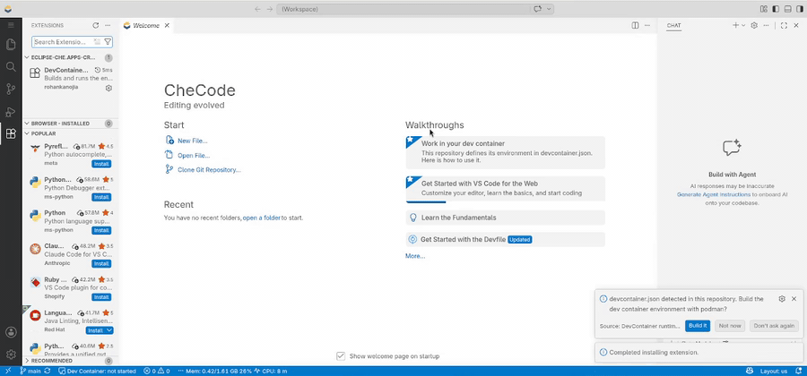

# DevContainer runtime support with podman

Builds and runs the environment declared in `devcontainer.json` as a rootless podman container
inside an Eclipse Che workspace, and opens terminals in it.

> **Proof of concept.** An experiment attached to
> [eclipse-che/che#23458](https://github.com/eclipse-che/che/issues/23458). Not supported, not
> hardened, and not affiliated with the Eclipse Foundation. It depends on unstable interfaces —
> `start-devcontainer.sh` and exact devfile task labels — and the container runs repository code
> with `--network=host`. Discussion belongs on the tracking issue.



## Supported configurations

Nothing here reimplements the devcontainer spec. `start-devcontainer.sh` drives the reference
implementation, [`@devcontainers/cli`](https://github.com/devcontainers/cli), with podman as the
container engine — so what works is, with one exception, whatever that CLI supports.

| `devcontainer.json` declares | |
| --- | --- |
| `image` | **Supported** |
| `build.dockerfile` (or legacy `dockerFile`) | **Supported** |
| `dockerComposeFile` + `service` | **Not supported** — silently ignored, see below |

Compose is the exception, and the limitation is in the setup script rather than in podman or the
CLI. The script runs `devcontainer build`, which builds images but never creates the services a
compose file declares; the resulting image is then run as a single container and
`dockerComposeFile` is **silently ignored**. You get a dev container that starts normally and is
missing every other service — a database that was never created rather than an error.

Compose itself works in this environment. Verified in an Eclipse Che workspace with
`podman-compose` installed: `devcontainer up --docker-path <podman>` brought up both services, the
compose network resolved `db` to a routable address, and PostgreSQL accepted connections.
Supporting it therefore means a second code path in the script — `devcontainer up`, discovering the
container from its output instead of assuming a name, and leaving lifecycle commands to the CLI —
plus a compose provider in the workspace image, which the universal developer image does not
currently ship.

Everything else follows the CLI's own support: lifecycle commands, `remoteUser`, `remoteEnv`,
mounts. If the CLI handles it, this does; if it does not, no amount of editor UI will change that.
The exception worth knowing about is `features`, which are fetched from OCI registries and built
against the base image, so they depend both on cluster egress and on that image's distribution
being one the feature supports.

## How it works

`start-devcontainer.sh` in the workspace is the engine: it invokes `@devcontainers/cli` to resolve
the config, build the image and run lifecycle commands, then starts the container with podman.
This extension is only the UI over it — it owns no devcontainer logic, which keeps the che-code
diff small and the script independently testable.

It reads the runtime description the script publishes, verifies the container with
`podman inspect`, and renders one status bar item:

| State | Meaning |
| --- | --- |
| Not started | A configuration exists, but nothing has been built |
| Building | A build is in flight — started here, or found via the script's lock file |
| Ready | Container running and verified by ID |
| Config changed | `devcontainer.json` differs from what the running container was built from |
| Unavailable | podman is not present in this workspace |

Clicking it opens every action in one menu: **Open Terminal in Dev Container**, **Rebuild**,
**Rebuild (No Cache)**, **Show Log**. Rebuild and log run the existing devfile tasks rather than
reimplementing them. A `devcontainer` terminal profile is also registered; regular new terminals
stay in the outer workspace container.

Extensions the dev container asks for are offered once per window: the ones not already
installed, taken from the built image's merged metadata so a Feature's contributions are included
alongside the repository's own list. Nothing is installed without being asked, and ids Open VSX
does not carry are named rather than failing silently.

The contract with the script — runtime JSON, lock file, config fingerprint — is documented in
[docs/script-integration.md](docs/script-integration.md). The extension cannot start a container
on its own, so review it alongside the `start-devcontainer.sh` change that publishes
`runtime.json`.

## Not implemented yet

- Applying its `settings` block (currently written at machine scope, so user settings win)
- Any `devcontainer.json` parsing — deliberately left to `@devcontainers/cli` in the script

## Build

Requires Node 18 or newer. There are no runtime dependencies.

```bash
npm install
npm run compile   # tsc -p .  ->  out/extension.js
npm test          # type-check plus unit tests
npm run package   # -> devcontainer-runtime-podman-<version>.vsix
```

`vsce` compiles for you during packaging; `npm run watch` recompiles on save.

To try it: press <kbd>F5</kbd> for an Extension Development Host, or install the VSIX with
**Extensions: Install from VSIX…** and reload the window. In an Eclipse Che workspace you can
build it in place — UDI has Node.

Without a `devcontainer.json` the extension hides its status bar item, does not probe containers,
and declines its commands with an explanatory message. It discovers `.devcontainer.json`,
`.devcontainer/devcontainer.json` and `.devcontainer/*/devcontainer.json`, including files added
while the editor is open.

## Continuous integration

`.github/workflows/build.yaml` runs `npm ci`, `npm test` and `npx vsce package` on pushes to
`main`, on pull requests, and on `v*` tags, uploading the VSIX as a build artifact. A `v*` tag
also attaches it to a GitHub release.
